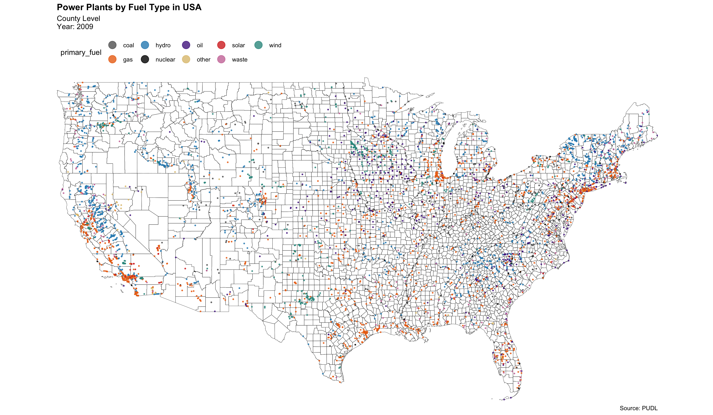
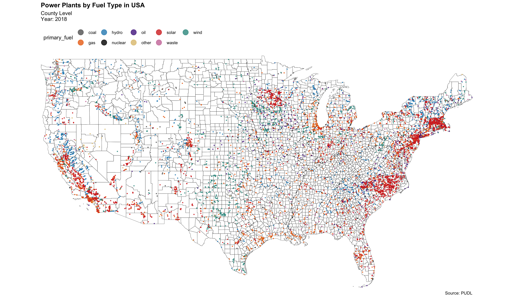
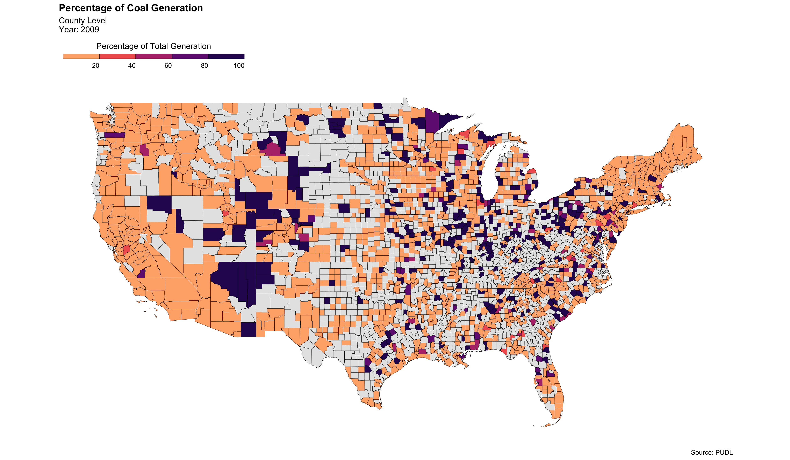
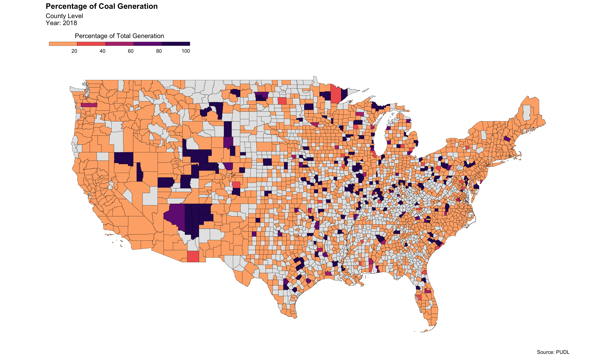

# Analyzing the Development and Decarbonization of the US Power Sector

Using the Public Utility Data Liberation(PUDL) project's SQLite Database to analyze how the US's power sector has evolved over time both in terms of quantity of power plants and intensity of coal generation (percentage of coal generation over total generation by county) from 2009 to 2018. 

The databse includes publicly available data from:
* EIA Form 860 (2009-2018)
* EIA Form 923 (2009-2018)
* EPA’s Continuous Emissions Monitoring System (1995-2018)
* FERC Form 1 (1994-2018)

## Files Included 

* Code
  - `PUDL_wrangling.ipynb`: extraction, cleaning, and wrangling of cost and generation data 
  - `PP_PUDL.R`: mapping 

* Output
  - CSVs: dataframes produced from the PUDL SQLite Database 
  - Figures: yearly maps

## Maps 

*Plants by Primary Fuel: 2009 to 2018* 

We see a clear increase in number of plants and more specifically in **solar**, **wind**, and **gas** plants. 

*Share of Coal Generation by County: 2009 to 2018* 

We see that:
  - more counties have power plants
  - power production has become **less coal dependent** 

## To Do:

Use a instrumental variable regression to analyze the effect of changing fuel prices on intensity of goal generation. 

## Data
https://catalyst.coop/pudl/ 
